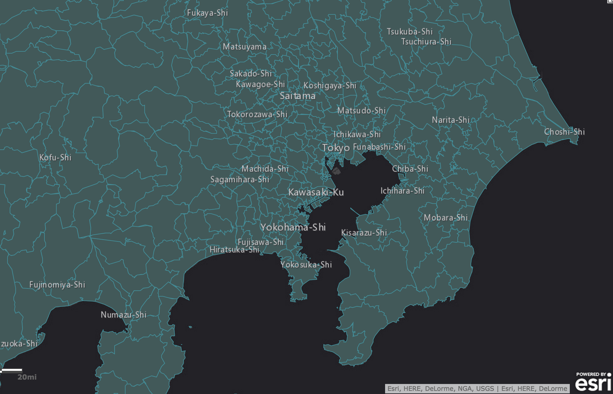
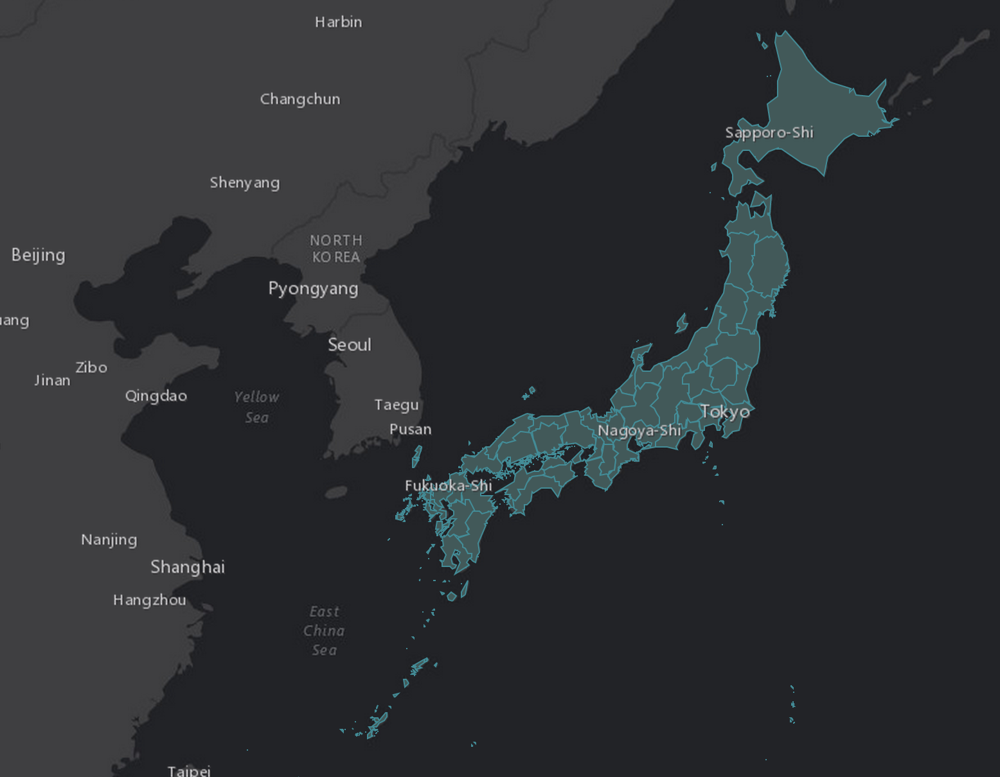

# Metadata Facts

##Japan's Municipalities

###MunicipalitiesDemographics.geojson
Feature Count: 1901

Min Scale: 1500001

Max Scale: 500001

Spatial Reference:4326

Max Allowable Offset: None

Geometry Precision: None

Source: http://demographics2.arcgis.com/arcgis/rest/services/JPN_Demographics_and_Boundaries/MapServer/8

###MunicipalitiesStandardGeographyQuery.geojson
Feature Count: 1901

FilterGeographyLayerID: "JP.Country"

FilterGeographyWhere: "Japan"

GeneralizationLevel: "6"

Spatial Reference:4326

SubGeographyLayerID: "JP.Municipalities"

Source: http://geoenrich.arcgis.com/arcgis/rest/services/World/GeoenrichmentServer/StandardGeographyQuery/execute?sourceCountry=JP&outSR=%7B%22wkid%22%3A102100%2C%22latestWkid%22%3A3857%7D&returnGeometry=true&generalizationLevel=6&returnSubGeographyLayer=true&geographyLayers=JP.Country&geographyQuery=Japan&subGeographyLayer=JP.Prefectures&f=json

##Japan's Prefectures

###PrefectureDemographics.geojson
Feature Count: 47

Min Scale: 20000000

Max Scale: 18000001

Spatial Reference:4326

Max Allowable Offset: None

Geometry Precision: None

Source: http://demographics2.arcgis.com/arcgis/rest/services/JPN_Demographics_and_Boundaries/MapServer/6

###PrefectureStandardGeographyQuery.geojson
Feature Count: 47

FilterGeographyLayerID: "JP.Country"

FilterGeographyWhere: "Japan"

GeneralizationLevel: "6"

Spatial Reference:4326

SubGeographyLayerID: "JP.Prefectures"

Source: http://geoenrich.arcgis.com/arcgis/rest/services/World/GeoenrichmentServer/StandardGeographyQuery/execute?sourceCountry=JP&outSR=%7B%22wkid%22%3A102100%2C%22latestWkid%22%3A3857%7D&returnGeometry=true&generalizationLevel=6&returnSubGeographyLayer=true&geographyLayers=JP.Country&geographyQuery=Japan&subGeographyLayer=JP.Prefectures&f=json

